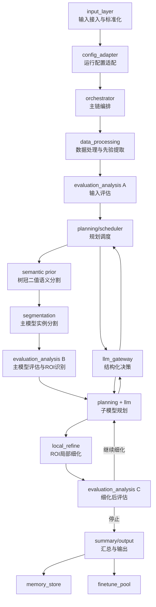
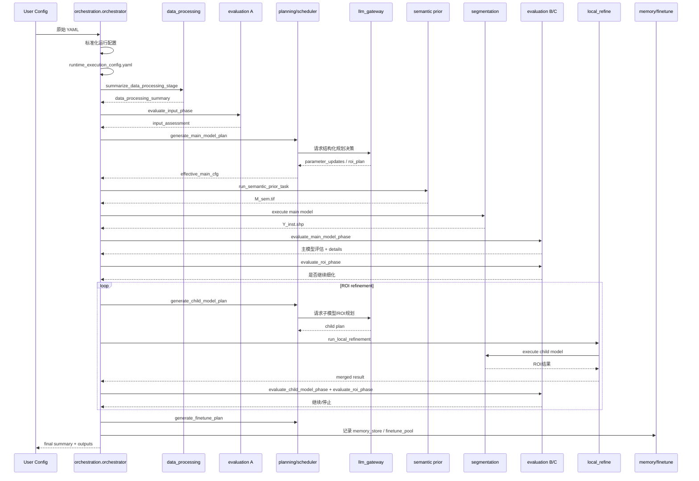

# ITD_agent 现行架构与运行逻辑说明

## 文档目的

本文档是本项目当前智能体架构的主维护文档。后续新增说明优先并入本文，不再拆成多个长文档。

重点回答以下问题：

- 智能体由哪些模块组成
- 每个模块在主流程中的职责是什么
- 关键脚本和入口文件分别做什么
- 主流程是按什么顺序执行的
- 分组推理、ROI 细化、记忆库、微调池如何接入主链
- 后续若细化某个模块或脚本，应该如何把新增解释记录补到本文档

本文档以“当前仓库真实实现”为准，不以历史方案、旧命名或理想蓝图为准。

## 推荐阅读顺序

1. [ITD_agent/orchestration/orchestrator.py](/home/xth/forest_agent_project/ITD_agent/orchestration/orchestrator.py)
2. [ITD_agent/orchestrator.py](/home/xth/forest_agent_project/ITD_agent/orchestrator.py)
3. [ITD_agent/orchestration/runtime_steps.py](/home/xth/forest_agent_project/ITD_agent/orchestration/runtime_steps.py)
4. [ITD_agent/planning/scheduler/runtime_scheduler.py](/home/xth/forest_agent_project/ITD_agent/planning/scheduler/runtime_scheduler.py)
5. [ITD_agent/segmentation/executor.py](/home/xth/forest_agent_project/ITD_agent/segmentation/executor.py)
6. [ITD_agent/evaluation_analysis/evaluator.py](/home/xth/forest_agent_project/ITD_agent/evaluation_analysis/evaluator.py)
## 总体架构



## 主流程时序



## 主流程分解

### 1. 输入接入与运行配置适配

- 统一主控入口：[ITD_agent/orchestration/orchestrator.py](/home/xth/forest_agent_project/ITD_agent/orchestration/orchestrator.py)
- 主要作用：
  - 读取用户原始 YAML
  - 调用输入适配器做配置归一化
  - 生成持久化运行配置 `runtime_execution_config.yaml`
  - 在同一主控模块内继续执行主编排链路

相关文件：

- [input_layer/adapters.py](/home/xth/forest_agent_project/input_layer/adapters.py)：把影像、DEM、调查数据、知识数据等组装成统一 `InputManifest`
- [input_layer/contracts.py](/home/xth/forest_agent_project/input_layer/contracts.py)：定义输入清单契约
- [ITD_agent/config_adapter.py](/home/xth/forest_agent_project/ITD_agent/config_adapter.py)：加载/保存运行配置，并保持运行时私有上下文

### 2. 主编排器

- 核心文件：[ITD_agent/orchestration/orchestrator.py](/home/xth/forest_agent_project/ITD_agent/orchestration/orchestrator.py)
- 主要作用：
  - 既承担启动入口，也承担主链编排
  - 决定走标准主链还是 grouped inference 分支
  - 串联数据处理、评估分析、规划调度、语义先验、实例分割、ROI 细化、总结输出
  - 管理 ROI while 循环
  - 汇总最终 summary 并触发记忆库/微调池写入

标准主链真实顺序：

1. `prepare_terrain_inputs_from_cfg`
2. `summarize_data_processing_stage`
3. `evaluate_input_phase`
4. `generate_main_model_plan`
5. `run_semantic_prior_task`
6. `execute_segmentation_model(main_model)`
7. `evaluate_main_model_phase`
8. `evaluate_roi_phase`
9. 若继续细化，循环执行：
   - `generate_child_model_plan`
   - `run_local_refinement`
   - `evaluate_child_model_phase`
   - `evaluate_roi_phase`
10. `build_finetune_recommendation`
11. `generate_finetune_plan`
12. `build_run_summary` / `finalize_run_summary`

### 3. 数据处理模块

目录：[ITD_agent/data_processing](/home/xth/forest_agent_project/ITD_agent/data_processing)

作用边界：

- 负责输入画像、基础先验提取、DEM 与参考调查矢量等辅助数据准备
- 负责 ROI 细化前的局部裁剪与局部数据包构建
- 不负责策略推理和模型参数决策

关键文件：

- [processor.py](/home/xth/forest_agent_project/ITD_agent/data_processing/processor.py)
  - 数据处理阶段总汇总入口
  - 输出 `data_processing_summary`
- [imagery/priors.py](/home/xth/forest_agent_project/ITD_agent/data_processing/imagery/priors.py)
  - DOM 影像画像
  - 提取分辨率、范围、纹理指标、tile 计划
  - 当前纹理指标包括：
    - `pixel_mean`
    - `pixel_std`
    - `gradient_mean`
    - `gradient_std`
    - `contrast`
    - `entropy`
    - `asm`
    - `energy`
    - `correlation`
    - `homogeneity`
    - `idm`
- [imagery/quality.py](/home/xth/forest_agent_project/ITD_agent/data_processing/imagery/quality.py) / [imagery/texture.py](/home/xth/forest_agent_project/ITD_agent/data_processing/imagery/texture.py) / [imagery/tile_plan.py](/home/xth/forest_agent_project/ITD_agent/data_processing/imagery/tile_plan.py)
  - 影像质量、纹理统计与切块计划辅助能力
- [terrain/dem_pipeline.py](/home/xth/forest_agent_project/ITD_agent/data_processing/terrain/dem_pipeline.py)
  - DEM 影像与 DOM 的对齐状态判断
- [inventory/normalizer.py](/home/xth/forest_agent_project/ITD_agent/data_processing/inventory/normalizer.py)
  - 调查表 / 参考调查矢量字段识别与标准字段映射
- [terrain/features.py](/home/xth/forest_agent_project/ITD_agent/data_processing/terrain/features.py)
  - 生成坡度、坡向、地貌、坡位等派生地形产品
- [inventory/spatial_context.py](/home/xth/forest_agent_project/ITD_agent/data_processing/inventory/spatial_context.py)
  - DOM/DEM/矢量的几何裁剪、空间上下文装配
- [knowledge/normalizer.py](/home/xth/forest_agent_project/ITD_agent/data_processing/knowledge/normalizer.py)
  - 领域知识数据标准化
- [public_data/indexer.py](/home/xth/forest_agent_project/ITD_agent/data_processing/public_data/indexer.py)
  - 公开数据集索引与可用性描述
- [roi/extractor.py](/home/xth/forest_agent_project/ITD_agent/data_processing/roi/extractor.py)
  - ROI 辅助提取逻辑
- [fusion_postprocess.py](/home/xth/forest_agent_project/ITD_agent/data_processing/fusion_postprocess.py)
  - 结果融合、去重、边界统一

### 4. 第一次评估分析：输入评估

目录：[ITD_agent/evaluation_analysis](/home/xth/forest_agent_project/ITD_agent/evaluation_analysis)

关键文件：

- [main_model_assessment.py](/home/xth/forest_agent_project/ITD_agent/evaluation_analysis/main_model_assessment.py)
- [roi_assessment.py](/home/xth/forest_agent_project/ITD_agent/evaluation_analysis/roi_assessment.py)
- [child_model_assessment.py](/home/xth/forest_agent_project/ITD_agent/evaluation_analysis/child_model_assessment.py)
- [final_assessment.py](/home/xth/forest_agent_project/ITD_agent/evaluation_analysis/final_assessment.py)
- [benchmark_engine.py](/home/xth/forest_agent_project/ITD_agent/evaluation_analysis/benchmark_engine.py)
- [online_quality_engine.py](/home/xth/forest_agent_project/ITD_agent/evaluation_analysis/online_quality_engine.py)
- [geometry_diagnostics.py](/home/xth/forest_agent_project/ITD_agent/evaluation_analysis/geometry_diagnostics.py)
- [decision_flags.py](/home/xth/forest_agent_project/ITD_agent/evaluation_analysis/decision_flags.py)

当前包含：

- 主模型阶段结果评估
- ROI 是否进入/继续细化的规则判定
- 专家模型 / 子模型结果对比评估
- 最终 reference / benchmark 评估
- 在线几何诊断、错误分解和决策 flags
- 微调前后效果评估

说明：

- `evaluation_analysis` 不再承担输入评估职责，输入契约已迁回 `input_layer`
- 当前模块只负责公式、规则、派生诊断和决策 flags，不负责 ROI 候选生成和 LLM 决策

### 5. LLM 网关

关键文件：[ITD_agent/llm_gateway/__init__.py](/home/xth/forest_agent_project/ITD_agent/llm_gateway/__init__.py)

作用边界：

- 只做结构化 JSON 决策请求
- 不直接执行业务逻辑
- 不直接跑分割模型

当前承担 3 类任务：

- 主模型规划决策
- ROI 是否继续细化的决策
- 运行后 retrospective 总结

说明：

- LLM 网关接收的是 `scheduler_context` 或 `run_summary`
- 因此只要上游把指标写入 `scene_profile` / `scheduler_context` / `metrics_summary`，LLM 就能直接看到并参与推理
- 当前输入已经开始按模板化方式收口，尤其是 `run_retrospective`

LLM 输入约束：

- 每类任务都使用固定 envelope：
  - `template_name`
  - `template_version`
  - `task_type`
  - `run_name`
  - `planning_stage`
  - `context`
- `context` 只保留可决策摘要，不直接传大块原始 JSON
- 统一优先使用这些摘要槽位：
  - `scene_profile`
  - `input_assessment_summary`
  - `image_texture_summary`
  - `metrics_summary`
  - `top_problem_cases`
  - `memory_digest`
  - `finetune_pool_digest`
- 目前已完成模板化的入口：
  - `run_retrospective`
- 后续仍需按同一原则继续收口：
  - `main_model_planning`
  - `child_model_planning`
  - `roi_decision`

### 6. 规划调度模块

目录：[ITD_agent/planning/scheduler](/home/xth/forest_agent_project/ITD_agent/planning/scheduler)

作用边界：

- 把评估分析、上下文记忆、LLM 结果转换成结构化运行计划
- 管理主模型计划、子模型计划、ROI 计划、知识嵌入计划、微调计划

关键文件：

- [context_builder.py](/home/xth/forest_agent_project/ITD_agent/planning/scheduler/context_builder.py)
  - 统一构造 `scheduler_context`
  - 当前已包含 `input_assessment`、`image_texture_analysis`、`scene_profile`、记忆库上下文、微调池上下文等
- [adaptive_config_generator.py](/home/xth/forest_agent_project/ITD_agent/planning/scheduler/adaptive_config_generator.py)
  - 从模板生成运行期配置
  - LLM 不可用时走 fallback updates
  - 当前 fallback 也已对齐纹理指标语义标签
- [runtime_scheduler.py](/home/xth/forest_agent_project/ITD_agent/planning/scheduler/runtime_scheduler.py)
  - 生成主模型/子模型/ROI/知识/微调等结构化计划
  - 管理子模型模板排序与路由
- [template_manager.py](/home/xth/forest_agent_project/ITD_agent/planning/scheduler/template_manager.py)
  - 参数更新合并
- [planner.py](/home/xth/forest_agent_project/ITD_agent/planning/scheduler/planner.py)
  - 规划入口封装

### 7. 语义先验步骤

关键文件：[ITD_agent/orchestration/runtime_steps.py](/home/xth/forest_agent_project/ITD_agent/orchestration/runtime_steps.py)

作用：

- 在主模型实例分割之前执行一次树冠二值语义分割
- 输出 `M_sem.tif`
- 为后续实例分割提供空间约束

说明：

- 该步骤位于主流程中
- 时序上在数据处理和主模型规划之后、主模型实例分割之前
- 归属上更接近“运行时先验步骤”，而不是 `data_processing` 子目录中的普通画像逻辑

### 8. 分割模型模块

目录：[ITD_agent/segmentation](/home/xth/forest_agent_project/ITD_agent/segmentation)

作用边界：

- 只负责模型接入、执行和训练/微调入口
- 不负责策略推理和路由决策

关键文件：

- [executor.py](/home/xth/forest_agent_project/ITD_agent/segmentation/executor.py)
  - 主模型 / 子模型统一执行门面
  - 支持脚本型分割和 registry 型分割
- [model_registry/registry.py](/home/xth/forest_agent_project/ITD_agent/segmentation/model_registry/registry.py)
  - 模型注册中心
- [model_registry/run_algorithm_entry.py](/home/xth/forest_agent_project/ITD_agent/segmentation/model_registry/run_algorithm_entry.py)
  - registry 算法统一执行入口
- [model_training](/home/xth/forest_agent_project/ITD_agent/segmentation/model_training)
  - 模型训练与测试入口
- [finetuning](/home/xth/forest_agent_project/ITD_agent/segmentation/finetuning)
  - 微调数据准备、伪标签、回灌等

补充说明：

- 当前主模型和子模型的路由由 `planning/scheduler` 生成
- 当前模板化独立子模型体系已接入架构，但子模型仍可在没有独立 checkpoint 时复用主分割引擎执行 ROI 局部重跑

### 9. 第二次与第三次评估分析

关键文件：

- [main_model_assessment.py](/home/xth/forest_agent_project/ITD_agent/evaluation_analysis/main_model_assessment.py)
- [reference_quality_engine.py](/home/xth/forest_agent_project/ITD_agent/evaluation_analysis/reference_quality_engine.py)
- [roi_assessment.py](/home/xth/forest_agent_project/ITD_agent/evaluation_analysis/roi_assessment.py)
- [child_model_assessment.py](/home/xth/forest_agent_project/ITD_agent/evaluation_analysis/child_model_assessment.py)
- [final_assessment.py](/home/xth/forest_agent_project/ITD_agent/evaluation_analysis/final_assessment.py)

职责分工：

- 第二次评估分析：
  - 对主模型结果做全局评估
  - 输出指标和问题参考单元明细
  - 识别待细化 ROI
- 第三次评估分析：
  - 对 ROI 细化后的合并结果做复评
  - 判断继续细化 / 停止
  - 为失败样本沉淀和微调建议提供依据

### 10. ROI 局部细化与 grouped inference

关键文件：

- [planning/agent/local_refine.py](/home/xth/forest_agent_project/ITD_agent/planning/agent/local_refine.py)
  - ROI 局部裁剪、局部配置生成、子模型执行、合并与复评
- [orchestration/grouped_inference.py](/home/xth/forest_agent_project/ITD_agent/orchestration/grouped_inference.py)
  - 分组推理主分支
- [planning/agent/xiaoban_planner.py](/home/xth/forest_agent_project/ITD_agent/planning/agent/xiaoban_planner.py)
  - 小班分组、分区参数规划

说明：

- `grouped_inference` 是标准主链之外的另一条分治式入口
- ROI 局部细化是标准主链中的循环局部修正机制
- 二者都依赖数据处理、评估分析、规划调度和分割模型模块，但作用粒度不同

### 11. 记忆库与微调池

关键目录：

- [ITD_agent/memory_store](/home/xth/forest_agent_project/ITD_agent/memory_store)
- [ITD_agent/finetune_pool](/home/xth/forest_agent_project/ITD_agent/finetune_pool)

作用：

- 记忆库：
  - 保存执行轨迹
  - 保存成功策略
  - 保存失败模式
  - 保存 retrospective
- 微调池：
  - 保存失败 ROI 样本
  - 保存 replay good sample
  - 保存公开数据集候选
  - 达到阈值后提供训练触发依据

说明：

- 当前主链默认不会每次运行后立刻训练
- 当前是“累计样本 -> 触发判断 -> 生成建议单/训练计划”

### 12. 输出与汇总

关键文件：

- [orchestration/summary_builder.py](/home/xth/forest_agent_project/ITD_agent/orchestration/summary_builder.py)
- [orchestration/output_management.py](/home/xth/forest_agent_project/ITD_agent/orchestration/output_management.py)
- [output_layer/reporting/experiment_report.py](/home/xth/forest_agent_project/output_layer/reporting/experiment_report.py)

职责：

- 组装 `ITD_agent_run_summary.json`
- 生成评估报告
- 物化树冠矢量、树木点位、可视化输出
- 同步运行期产物到持久目录
- 清理临时运行目录

## 关键入口与脚本说明

| 类型 | 文件 | 作用 |
| --- | --- | --- |
| 统一主控入口 | [ITD_agent/orchestration/orchestrator.py](/home/xth/forest_agent_project/ITD_agent/orchestration/orchestrator.py) | 负责配置标准化、运行时配置落盘与主链编排 |
| 兼容导出 | [ITD_agent/orchestrator.py](/home/xth/forest_agent_project/ITD_agent/orchestrator.py) | 历史导入路径兼容壳 |
| LLM 网关 | [ITD_agent/llm_gateway/__init__.py](/home/xth/forest_agent_project/ITD_agent/llm_gateway/__init__.py) | 结构化决策请求 |
| 主流程脚本 | [scripts/run_ITD_agent_experiment.py](/home/xth/forest_agent_project/scripts/run_ITD_agent_experiment.py) | 调用 `run_itd_agent(...)` 的 CLI 包装 |
| 评估脚本 | [scripts/evaluate_reference_quality.py](/home/xth/forest_agent_project/scripts/evaluate_reference_quality.py) | 对主模型/ROI 结果做参考质量评估 |
| 分组实验脚本 | [scripts/run_grouped_experiment.py](/home/xth/forest_agent_project/scripts/run_grouped_experiment.py) | 从脚本侧触发 grouped 推理 |
| 分割模型列表 | [scripts/list_segmentation_models.py](/home/xth/forest_agent_project/scripts/list_segmentation_models.py) | 列出已注册分割模型 |
| ROI 结果评估 | [scripts/evaluate_roi_refinement_result.py](/home/xth/forest_agent_project/scripts/evaluate_roi_refinement_result.py) | ROI 细化效果评估辅助脚本 |
| 数据处理微调 | [scripts/run_finetune_pipeline.py](/home/xth/forest_agent_project/scripts/run_finetune_pipeline.py) | 串联伪标签选择、伪数据集构建、轻量训练、推理和增益评估 |
| 公开数据微调 | [scripts/run_public_finetune_pipeline.py](/home/xth/forest_agent_project/scripts/run_public_finetune_pipeline.py) | 公开数据处理微调入口 |
| 公开分割模型微调 | [scripts/run_public_segmentation_model_finetune_pipeline.py](/home/xth/forest_agent_project/scripts/run_public_segmentation_model_finetune_pipeline.py) | 公开实例分割模型训练、推理和增益评估入口 |
| COCO benchmark | [scripts/benchmark_coco_instance_dataset.py](/home/xth/forest_agent_project/scripts/benchmark_coco_instance_dataset.py) | COCO 实例分割 benchmark 工具 |
| ISPRS 专家拆分 | [scripts/prepare_isprs_itd_expert_splits.py](/home/xth/forest_agent_project/scripts/prepare_isprs_itd_expert_splits.py) | ISPRS ITD 专家训练/验证 split 准备 |
| 专家训练配置生成 | [scripts/generate_isprs_itd_expert_training_configs.py](/home/xth/forest_agent_project/scripts/generate_isprs_itd_expert_training_configs.py) | 从专家模板生成训练配置 |
| 专家全套运行 | [scripts/run_isprs_itd_expert_full_suite.sh](/home/xth/forest_agent_project/scripts/run_isprs_itd_expert_full_suite.sh) | shell 方式串联专家训练配置 |
| 记忆库压缩 | [scripts/compact_memory_store.py](/home/xth/forest_agent_project/scripts/compact_memory_store.py) | 压缩 memory_store 记录并重建索引 |
| DOM 切片 | [scripts/tile_dom_by_meters.py](/home/xth/forest_agent_project/scripts/tile_dom_by_meters.py) | 按米级窗口切分 DOM |

工具目录：

- [tools/runtime_cache_client.py](/home/xth/forest_agent_project/tools/runtime_cache_client.py) / [tools/runtime_cache_worker.py](/home/xth/forest_agent_project/tools/runtime_cache_worker.py)
  - 为 grouped inference 和局部细化复用长生命周期运行时资源。
- [tools/cached_stage_runners.py](/home/xth/forest_agent_project/tools/cached_stage_runners.py)
  - 提供语义先验和分割阶段的进程内缓存实现。
- [tools/process_runner.py](/home/xth/forest_agent_project/tools/process_runner.py)
  - 子进程执行辅助。
- [tools/stretch_tiles.py](/home/xth/forest_agent_project/tools/stretch_tiles.py)
  - 栅格 tile 拉伸辅助工具。

## 当前实现中的关键边界

### 1. LLM 不是自由自治体

当前实现中，LLM 更像“结构化决策插槽”，不是完全自主规划和执行的 general agent。

### 2. 子模型体系已接入，但仍支持模板回退

当前子模型已支持模板化独立配置和路由，但若没有独立 checkpoint，仍可回退为：

- 主分割引擎
- ROI 局部子图
- 模板化参数重规划

### 3. 数据处理与语义先验是两个相邻步骤

- `data_processing` 负责画像、整理、空间准备、局部裁剪
- 树冠二值语义先验在主流程中独立执行

### 4. 训练触发是阈值式，不是每轮自动执行

当前主链默认只生成：

- 微调建议
- 训练计划
- 触发快照

训练应在样本积累达到阈值后触发。

## 以后如何追加解释记录

本文件用于持续维护。以后每次细化某个模块或脚本时，应同时补本文档，至少补以下 3 类信息：

1. 功能新增了什么
2. 该新增接到了主流程的哪个位置
3. 下游哪些模块会消费这个新增结果

建议在每次模块细化后，按下面模板追加到“新增解释记录”中。

### 记录模板

```md
## YYYY-MM-DD 模块细化记录

- 模块：
- 涉及文件：
- 变更目的：
- 新增能力：
- 对主流程的影响：
- 对下游模块的影响：
- 是否需要更新运行逻辑图：
- 是否需要补充测试或实测记录：
```

## 新增解释记录

### 2026-04-01 输入评估新增森林类型、林分条件与纹理分析

- 模块：`input_layer / data_processing.processing_summary`
- 涉及文件：
  - `input_layer/*`
  - `ITD_agent/data_processing/*`
  - [ITD_agent/data_processing/imagery/priors.py](/home/xth/forest_agent_project/ITD_agent/data_processing/imagery/priors.py)
  - [ITD_agent/memory_store/query.py](/home/xth/forest_agent_project/ITD_agent/memory_store/query.py)
  - [ITD_agent/planning/scheduler/context_builder.py](/home/xth/forest_agent_project/ITD_agent/planning/scheduler/context_builder.py)
  - [ITD_agent/planning/scheduler/adaptive_config_generator.py](/home/xth/forest_agent_project/ITD_agent/planning/scheduler/adaptive_config_generator.py)
  - [ITD_agent/llm_gateway/__init__.py](/home/xth/forest_agent_project/ITD_agent/llm_gateway/__init__.py)
- 变更目的：
  - 让第一次输入评估不再只做模态检查，还能输出可被后续规划直接消费的场景判断结果
- 新增能力：
  - 新增 `forest_type`
  - 新增 `stand_condition`
  - 新增 `image_texture_analysis`
  - 新增纹理指标：
    - `contrast`
    - `entropy`
    - `asm`
    - `energy`
    - `correlation`
    - `homogeneity`
    - `idm`
  - 新增纹理语义标签，例如：
    - `strong_edge`
    - `texture_complex`
    - `texture_smooth`
    - `texture_rough`
- 对主流程的影响：
  - 第一次评估分析输出的 `scene_analysis` 更完整
  - 调度上下文 `scheduler_context` 已可直接读取纹理分析结果
- 对下游模块的影响：
  - `LLM 网关` 可直接读取这些指标和标签参与推理
  - `规划调度` 可在 fallback 规划与子模型路由中使用这些标签
  - `memory_store / finetune_pool` 可记录这些场景标签
- 是否需要更新运行逻辑图：
  - 否，运行顺序未变，只是输入评估内容增强
- 是否需要补充测试或实测记录：
  - 建议下一次端到端实测后，把包含新 `data_processing.input_assessment.scene_analysis` 的 summary 路径附到本文档

### 2026-04-02 LLM 网关输入模板化规范补充

- 模块：`llm_gateway / planning.scheduler`
- 涉及文件：
  - 本文第 `5` 节 `LLM 网关`
- 变更目的：
  - 解决 LLM 输入过大、过散、难维护的问题
- 新增能力：
  - 形成按任务类型区分的输入模板规范
  - 明确 `scene_profile / input_assessment_summary / image_texture_summary / metrics_summary / top_problem_cases / memory_digest / finetune_pool_digest` 这些统一槽位
- 对主流程的影响：
  - 当前仅新增文档规范，运行逻辑暂未改动
- 对下游模块的影响：
  - 后续重构 `planning`、`roi_decision`、`retrospective` 时应按该规范收口
- 是否需要更新运行逻辑图：
  - 否，运行顺序未变
- 是否需要补充测试或实测记录：
  - 建议后续在真正完成模板化重构后，单独记录一次 `retrospective` token 压缩前后对比

### 2026-04-02 run_retrospective 模板化落地与验收

- 模块：`llm_gateway`
- 涉及文件：
  - [ITD_agent/llm_gateway/__init__.py](/home/xth/forest_agent_project/ITD_agent/llm_gateway/__init__.py)
  - 本文第 `5` 节 `LLM 网关`
- 变更目的：
  - 将 `run_retrospective` 从“整块运行摘要直传”改成“固定模板 + 摘要槽位”的输入方式
- 新增能力：
  - 新增 `run_retrospective` 结构化 envelope
  - 新增 `scene_profile / input_assessment_summary / final_metrics_summary / roi_round_summary / top_problem_cases / memory_digest / finetune_pool_digest` 摘要构造
  - 复盘 prompt 只消费模板化输入，不再直接注入大块原始 `run_summary`
- 对主流程的影响：
  - 运行时序不变
  - `run_retrospective` 的输入内容显著收敛，降低 token 超限风险
- 对下游模块的影响：
  - 后续 `main_model_planning / child_model_planning / roi_decision` 可沿用同一模板化思路继续收口
- 是否需要更新运行逻辑图：
  - 否，运行顺序未变，仅 LLM 网关输入组织方式改变
- 是否需要补充测试或实测记录：
  - 已完成真实 API 验证
  - 使用 [ITD_agent_run_summary.json](/home/xth/forest_agent_project/outputs/JX_ShanXia/dom177_e2e_smoketest/ITD_agent_run_summary.json) 构造的 `run_retrospective` 模板输入约 `2033` 字符
  - 实际调用结果为 `status=completed`
  - 之前该阶段曾报错 `Total tokens of image and text exceed max message tokens`，本次未复现

## 维护约束

- 不要把本文档写成一次性设计稿，应始终以仓库现状为准
- 若某个模块的职责发生边界变化，必须同步更新“总体架构”“主流程分解”“关键入口与脚本说明”
- 若新增脚本已成为对外入口，应补到“关键入口与脚本说明”
- 若只是局部小修，不必改逻辑图，但应至少追加一条“新增解释记录”
